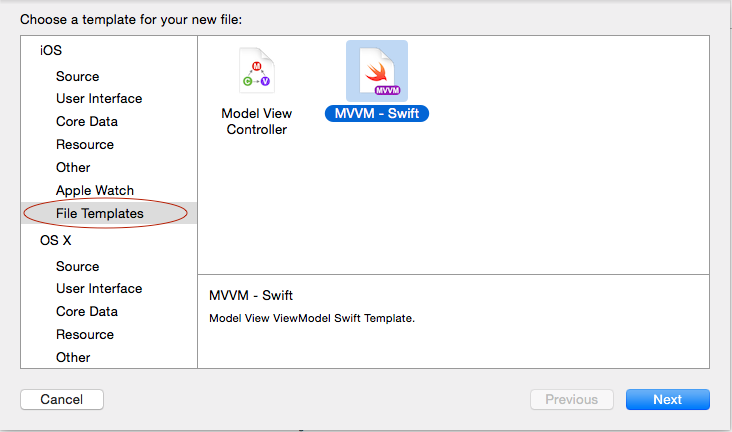

Xcode Templates
================

# Installation  
Just checkout this repository and execute `insall` by double-clicking on it or running `./install` in terminal.

It will copy templates to your Library templates directory.

To use templates, start creating **New File (⌘ + N)**. On the bottom of iOS templates list, there is **File Templates**. It's custom users' templates menu, where all custom templates can be found.

It will ask you to enter simply name of the screen you want to create, e.g AccountInfo, without any ViewController suffixes etc.
As a result you'll get Factory, Model, View, Controller and Xib files.

# Motivation

###MVC

* **Model** *(NSObject)* – is **BLL** that provides neede data that can be used to be shown and has nothing to do with UI at all
* **View** *(UIView)* – is **UI** that has pointer to its **_delegate_** and **_dataSource_** that react on its events and provide all needed data
* **Controller** *(UIViewController)* – is **controller** that is actually a **bridge** between **Model** and **View**. It implements View's delegate and dataSource protocols and gets all the data from Model. It may format and prepare data for **View** in a way that it's needed to be shown. *(BTW alerts and other controllers should be shown from Controller because alert is actually a UIAlertController since iOS 8)*
* **Factory** – is a factory that tries to implement [DI](http://en.wikipedia.org/wiki/Dependency_injection). It creates controller and injects all dependencies there including model and its dependencies. (Would like to migrate to [Typhoon](http://www.typhoonframework.org) in the nearest future)

###MVVM

* **Model** (Prefered Object instead of Struct) – is **BLL** that provides neede data that can be used to be shown and has nothing to do with UI at all
* **View** *(UIViewController)* (Can be additionally split into UIView if needed). A **View** can have its **own ViewModel**, or it can inherit its **parent's ViewModel**.
* **ViewModel** (Prefered Object instead of Struct) Provides data from **Model** that **View** can easily use.

The view knows about the view model, and the view model knows about the model, but the model is unaware of the view model, and the view model is unaware of the view.
More on this can be found [here (MSDN description)](https://msdn.microsoft.com/en-us/library/hh848246.aspx) or [here (with reference to Reactive MVVM)](https://github.com/ReactiveCocoa/ReactiveViewModel)

